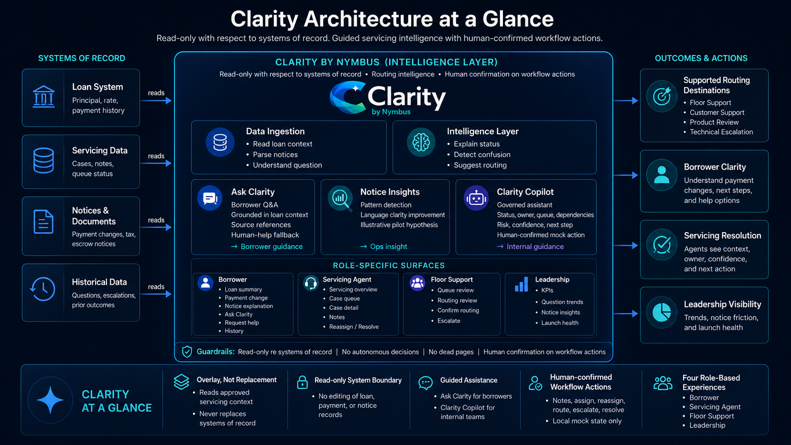

# Clarity by Nymbus

Clarity by Nymbus is a loan servicing intelligence portal.
This repo holds the locked planning inputs, visual tokens, page tree, build contract, and SDLC package that keep the POC aligned.

## At a Glance

| What | Why it matters |
|---|---|
| Read-only guidance layer | Clarity overlays servicing, it does not replace it |
| Portal shell + role selector | The UI starts as a clean Nymbus portal, not a dead-end splash page |
| Mock data only | The POC stays deterministic and reviewable |
| Human-confirmed routing | No autonomous close, route, or resolve behavior |

## Visual Baseline

## Current UI Pack

| Screen | Purpose |
|---|---|
| Portal shell / role selector | Entry surface for Borrower, Servicing Agent, Floor Support, Leadership |
| Borrower Home | Loan summary, payment change, recent notice, next step |
| Loan Detail | Full loan context and partial-data state |
| Notice Detail | Plain-language notice explanation with callouts |
| Ask Clarity | Grounded borrower Q&A with source references |
| Request Help | Escalation intake with human confirmation |
| Escalation Confirmation | Reference number and next step |
| Loan History | Prior notices, questions, and outcomes |
| Servicing Home | Operational overview, queue preview, and launch health |
| Case Queue | Working queue with owner, confidence, and SLA risk |

## Start Here

Read in this order:

1. [Build Contract](./BUILD_CONTRACT.md)
2. [Locked V0 Design Prompt](./03-sdlc-release-package/clarity/15-V0-DESIGN-PROMPT.md)
3. [Requirements](./03-sdlc-release-package/clarity/01-REQUIREMENTS.md)
4. [Architecture](./03-sdlc-release-package/clarity/03-ARCHITECTURE.md)
5. [User Stories](./03-sdlc-release-package/clarity/04-USER-STORIES.md)
6. [Page Tree](./02-mvp-page-tree/clarity.mvp.page-tree.md)
7. [Design Tokens](./01-design-system-tokens/clarity.tokens.css)

## What This Repo Is For

- Lock the Clarity story before building
- Keep the repo, Drive, and Kiro mirror in sync
- Make the portal feel premium, calm, and operationally serious
- Keep the build lean enough to review without extra explanation

## Folder Map

| Folder | What lives here |
|---|---|
| `01-design-system-tokens/` | `clarity.tokens.css` and the captured theme variables |
| `02-mvp-page-tree/` | Screen map and no-dead-page route plan |
| `03-sdlc-release-package/` | Full SDLC package: requirements, architecture, user stories, acceptance criteria, DoD, story points, teams impacted, support plan, change log, UI prototype brief, v0 UI pack, locked V0 design prompt, AI usage |
| `.kiro/specs/clarity-by-nymbus/` | Kiro-ready mirror of the same Clarity spec set |
| `04-brand-assets/` | Clarity wordmark and the architecture diagram used in the README and docs |

## Purpose

These files are labeled so someone outside the build can quickly see:

- what the visual system is
- what screens exist
- how the MVP is organized
- what to build first

## Quick View

- Logo: `04-brand-assets/clarity-logo.png`
- Architecture: `04-brand-assets/clarity-architecture-dark.png`
- Light architecture variant: `04-brand-assets/clarity-architecture-light.png`
- Build contract: `BUILD_CONTRACT.md`
- UI prompt: `03-sdlc-release-package/clarity/15-V0-DESIGN-PROMPT.md`
- UI image pack source folder: `Clarity by Nymbus - UI Image Pack`
- Drive UI pack folder: `Clarity by Nymbus - UI Image Pack`
- Kiro spec pack: `.kiro/specs/clarity-by-nymbus/`
