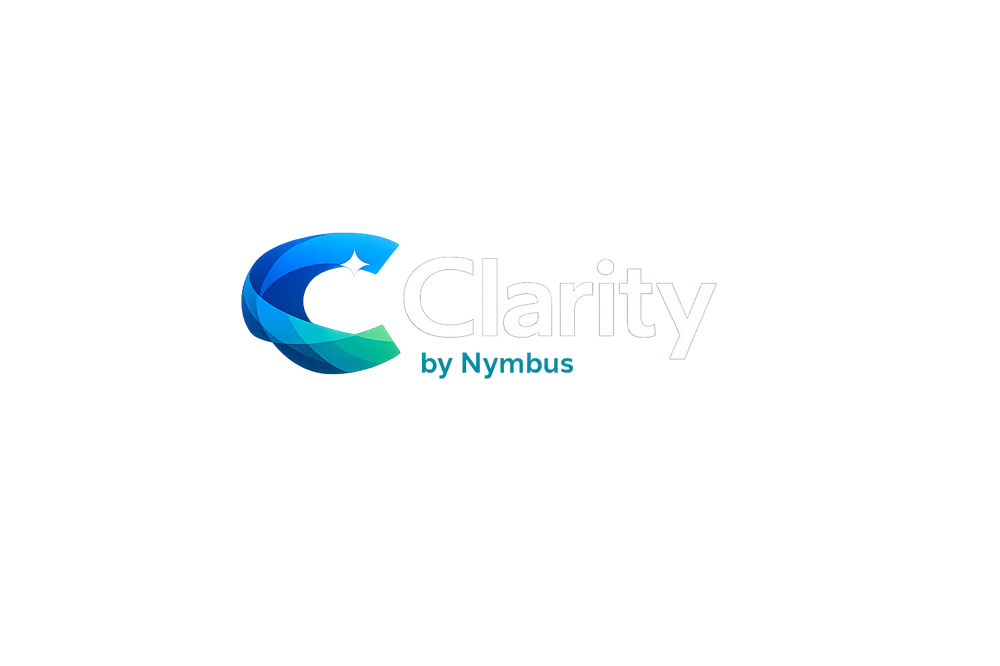

# Clarity by Nymbus

Clarity by Nymbus is a loan servicing intelligence portal.
This repo holds the locked planning inputs, visual tokens, page tree, build contract, and SDLC package that keep the POC aligned.

## At a Glance

| What | Why it matters |
|---|---|
| Read-only guidance layer | Clarity overlays servicing, it does not replace it |
| Portal shell + role selector | The UI starts as a clean Nymbus portal, not a dead-end splash page |
| Mock data only | The POC stays deterministic and reviewable |
| Human-confirmed routing | No autonomous close, route, or resolve behavior |

## Live Demo

**Live URL:** [https://clarity-sage-eight.vercel.app/](https://clarity-sage-eight.vercel.app/)
**Repo:** [github.com/redlanternstudios/clarity_by_Nymbus](https://github.com/redlanternstudios/clarity_by_Nymbus)

## Local Setup

```bash
git clone https://github.com/redlanternstudios/clarity_by_Nymbus.git
cd clarity_by_Nymbus
npm install
```

Create `.env.local` in the repo root:

```
OPENAI_API_KEY=sk-...
```

Run locally:

```bash
npm run dev
```

Open [http://localhost:3000](http://localhost:3000).

Build check (what CI/Vercel runs):

```bash
npm run build
```

## Stack

- Next.js 16 (App Router), React 19, TypeScript
- Tailwind CSS v4
- Vercel AI SDK (`ai`, `@ai-sdk/openai`) — real OpenAI `gpt-4o-mini` call powering `/api/ask-clarity`
- Deployed on Vercel

## AI / Product Decisions

- **Ask Clarity is a real LLM call, not scripted responses.** `app/api/ask-clarity/route.ts` uses `streamText` against `gpt-4o-mini` with a data-minimized context (only the mock loan/notice fields the borrower is allowed to see) and an explicit system prompt.
- **Prompt-injection resistant by design.** Inbound questions are checked against a hard-block regex list (ignore instructions, reveal system prompt, "act as," jailbreak patterns, etc.) before the model is ever called, and the system prompt itself carries redundant override-proof rules.
- **Explicit fallback state.** When the model can't ground an answer in the provided loan/notice data, it returns a fixed `FALLBACK_MESSAGE` directing the borrower to Get Help — the app never lets the model guess about a real loan.
- **No autonomous action.** Every routing, escalation, or resolution suggestion in the servicing views is confirm-gated — nothing closes, routes, or resolves without an explicit human click. (Note: as of 2026-07-31, some of those confirm buttons on newer servicing pages are UI-only and not yet wired to a state change — see `.kiro/specs/clarity-by-nymbus/tasks.md` for the exact list.)
- **Mock data only.** Nothing in this POC touches a real borrower, real loan, or production system.

## Known Gaps / Future Work

Tracked in detail in `.kiro/specs/clarity-by-nymbus/tasks.md`. Current honest state as of 2026-07-31:

- Case Queue row-level action menu (assign / change status / escalate / close) is not yet wired — button exists, no handler.
- Routing Rules reference page currently lists a different destination taxonomy than the rest of the app uses; needs to be reconciled to the four canonical destinations.
- Case Detail, Trends, Notice Insights, and Clarity Copilot pages are built and render real content but are thinner than their full spec (buttons present but not all wired to state changes; some data points from the spec aren't populated).
- Kiro's automatic session/collaboration-history hook has not been independently verified as active for this repo.

## Visual Baseline


## Current UI Pack

| Screen | Purpose |
|---|---|
| Portal shell / role selector | Entry surface for Borrower, Servicing Agent, Floor Support, Leadership |
| Borrower Home | Loan summary, payment change, recent notice, next step |
| Loan Detail | Full loan context and partial-data state |
| Notice Detail | Plain-language notice explanation with callouts |
| Ask Clarity | Grounded borrower Q&A with source references |
| Request Help | Escalation intake with human confirmation |
| Escalation Confirmation | Reference number and next step |
| Loan History | Prior notices, questions, and outcomes |
| Servicing Home | Operational overview, queue preview, and launch health |
| Case Queue | Working queue with owner, confidence, and SLA risk |

## Start Here

Read in this order:

1. [Build Contract](./BUILD_CONTRACT.md)
2. [Locked V0 Design Prompt](./03-sdlc-release-package/clarity/15-V0-DESIGN-PROMPT.md)
3. [Requirements](./03-sdlc-release-package/clarity/01-REQUIREMENTS.md)
4. [Architecture](./03-sdlc-release-package/clarity/03-ARCHITECTURE.md)
5. [User Stories](./03-sdlc-release-package/clarity/04-USER-STORIES.md)
6. [Page Tree](./02-mvp-page-tree/clarity.mvp.page-tree.md)
7. [Design Tokens](./01-design-system-tokens/clarity.tokens.css)
8. [Loan Servicing Intelligence Overview (PDF)](./Clarity%20by%20Nymbus%20-%20Loan%20Servicing%20Intelligence.pdf)
9. [Anticipated Team(s) Impact (PDF)](./Clarity%20by%20Nymbus_Mock.MVP.Anticipated-Team%28s%29-Impact.pdf)
10. [Change Log — including build tooling obstacles and how they were resolved](./03-sdlc-release-package/clarity/10-CHANGE-LOG.md)

## What This Repo Is For

- Lock the Clarity story before building
- Keep the repo, Drive, and Kiro mirror in sync
- Make the portal feel premium, calm, and operationally serious
- Keep the build lean enough to review without extra explanation

## Folder Map

| Folder | What lives here |
|---|---|
| `01-design-system-tokens/` | `clarity.tokens.css` and the captured theme variables |
| `02-mvp-page-tree/` | Screen map and no-dead-page route plan |
| `03-sdlc-release-package/` | Full SDLC package: requirements, architecture, user stories, acceptance criteria, DoD, story points, teams impacted, support plan, change log, UI prototype brief, v0 design prompt |
| `.kiro/specs/clarity-by-nymbus/` | Kiro-ready mirror of the same Clarity spec set |
| `04-brand-assets/` | Clarity wordmark and the architecture diagram used in the README and docs |

## Purpose

These files are labeled so someone outside the build can quickly see:

- what the visual system is
- what screens exist
- how the MVP is organized
- what to build first

## Quick View

- Logo: `04-brand-assets/clarity-logo.png`
- Architecture: `04-brand-assets/clarity-architecture-dark.png`
- Light architecture variant: `04-brand-assets/clarity-architecture-light.png`
- Build contract: `BUILD_CONTRACT.md`
- UI prompt: `03-sdlc-release-package/clarity/15-V0-DESIGN-PROMPT.md`
- UI image pack source folder: `Clarity by Nymbus - UI Image Pack`
- Drive UI pack folder: `Clarity by Nymbus - UI Image Pack`
- Kiro spec pack: `.kiro/specs/clarity-by-nymbus/`
- Loan Servicing Intelligence overview: [`Clarity by Nymbus - Loan Servicing Intelligence.pdf`](./Clarity%20by%20Nymbus%20-%20Loan%20Servicing%20Intelligence.pdf)
- Anticipated team(s) impact: [`Clarity by Nymbus_Mock.MVP.Anticipated-Team(s)-Impact.pdf`](./Clarity%20by%20Nymbus_Mock.MVP.Anticipated-Team%28s%29-Impact.pdf)
