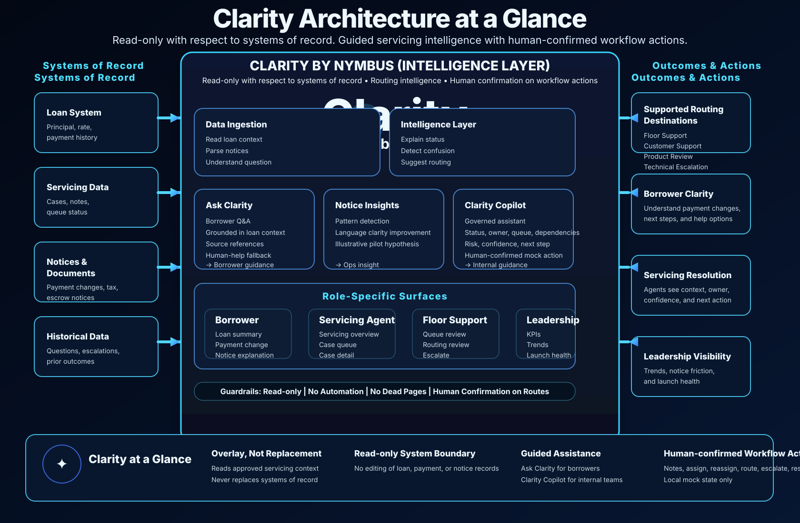

# Clarity by Nymbus

  

  

## Next Up

Read in this order:

1. Architectural Input/Outputs diagram
2. → [Loan Servicing Intelligence](./Loan-Servicing-Intelligence.pdf)
3. → [Anticipated Team Impact](./Anticipated-Team-Impact.pdf)
4. → [Build Contract](./BUILD_CONTRACT.md)

> Start with the diagram above, then open the two PDFs in order.

## Featured Documents

### 1. Loan Servicing Intelligence

- **Priority read immediately after the architecture diagram**
- Source file: `Loan-Servicing-Intelligence.pdf`
- Purpose: explains the loan servicing intelligence concept in detail
- Why it matters: this is the operating story behind the diagram

### 2. Anticipated Team Impact

- **Priority read immediately after Loan Servicing Intelligence**
- Source file: `Anticipated-Team-Impact.pdf`
- Purpose: shows the expected team impact and operating implications
- Why it matters: this is the people and workflow impact layer

### 3. Build Contract

- **Implementation lock for the clickable POC and image pack**
- Source file: `BUILD_CONTRACT.md`
- Purpose: defines the canonical mock data, screen specs, click outcomes, role mapping, and state matrix
- Why it matters: this prevents route drift, screenshot drift, and invented behavior

This repo contains the MVP planning inputs for the Clarity concept.

## Folder map

- `01-design-system-tokens/`
  - `clarity.tokens.css`
  - Screenshot-derived design tokens and theme variables
- `02-mvp-page-tree/`
  - `clarity.mvp.page-tree.md`
  - Screen map and no-dead-page route plan
- `03-sdlc-release-package/`
  - Full SDLC package: requirements, architecture, user stories, acceptance criteria, DoD, story points, teams impacted, post-release support, change log, UI prototype brief, v0 UI pack
- `.kiro/specs/clarity-by-nymbus/`
  - Kiro-ready spec pack: requirements, design, tasks, and pack README
- `04-brand-assets/`
  - `clarity-logo.png` — primary Clarity by Nymbus wordmark and glyph
  - `clarity-architecture-dark.png` — branded system architecture diagram, dark theme
  - `clarity-architecture-light.png` — branded system architecture diagram, light theme
  - `clarity-architecture-high-level.svg` — current high-level architecture diagram used on the README

## Purpose

These files are intentionally labeled for people outside the build so they can quickly see:

- what the visual system is
- what screens exist
- how the MVP is organized
- what to build first

## Quick view

- Logo: `04-brand-assets/clarity-logo.png`
- Architecture: `04-brand-assets/clarity-architecture-high-level.svg`
- Legacy architecture variant: `04-brand-assets/clarity-architecture-dark.png`
- Light architecture variant: `04-brand-assets/clarity-architecture-light.png`
- Loan servicing: `Loan-Servicing-Intelligence.pdf`
- Team impact: `Anticipated-Team-Impact.pdf`
- Build contract: `BUILD_CONTRACT.md`

